# AIDLC C4架构视图

使用C4架构方法（Context, Container, Component, Code）展示AI驱动开发生命周期(AIDLC)的多维度架构。

---

## Level 1: Context（上下文层）- 生命周期全景与质量门禁

### 1.1 生命周期全景

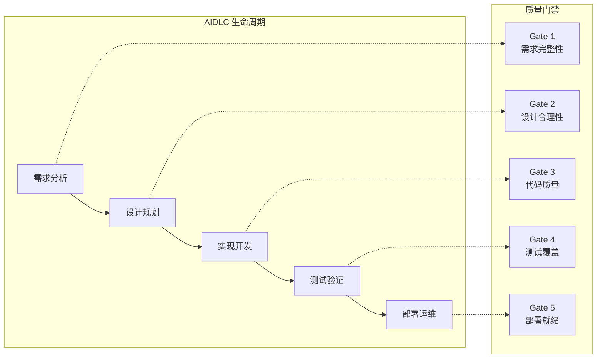
```mermaid
flowchart LR
    subgraph Lifecycle["AIDLC 生命周期"]
        direction LR
        R[需求分析] --> D[设计规划] --> I[实现开发] --> T[测试验证] --> P[部署运维]
    end

    subgraph Gates["质量门禁"]
        direction LR
        G1[Gate 1<br/>需求完整性]
        G2[Gate 2<br/>设计合理性]
        G3[Gate 3<br/>代码质量]
        G4[Gate 4<br/>测试覆盖]
        G5[Gate 5<br/>部署就绪]
    end

    R -.-> G1
    D -.-> G2
    I -.-> G3
    T -.-> G4
    P -.-> G5
```

### 1.2 质量门禁详细流程

```mermaid
flowchart TB
    subgraph G1["Gate 1: 需求完整性"]
        G1_in[准入: 原始需求输入]
        G1_check{需求文档<br/>完整/无歧义/可验证?}
        G1_out[准出: 需求已确认]
        G1_in --> G1_check
        G1_check -->|通过| G1_out
        G1_check -->|不通过| G1_in
    end

    subgraph G2["Gate 2: 设计合理性"]
        G2_in[准入: 需求已确认]
        G2_check{架构可行?<br/>技术选型合理?}
        G2_out[准出: 设计已批准]
        G2_in --> G2_check
        G2_check -->|通过| G2_out
        G2_check -->|不通过| G2_in
    end

    subgraph G3["Gate 3: 代码质量"]
        G3_in[准入: 设计已批准]
        G3_check{代码规范?<br/>测试通过?<br/>无安全漏洞?}
        G3_out[准出: 代码已提交]
        G3_in --> G3_check
        G3_check -->|通过| G3_out
        G3_check -->|不通过| G3_in
    end

    subgraph G4["Gate 4: 测试覆盖"]
        G4_in[准入: 代码已提交]
        G4_check{覆盖率达标?<br/>无阻塞缺陷?}
        G4_out[准出: 测试已通过]
        G4_in --> G4_check
        G4_check -->|通过| G4_out
        G4_check -->|不通过| G4_in
    end

    subgraph G5["Gate 5: 部署就绪"]
        G5_in[准入: 测试已通过]
        G5_check{环境就绪?<br/>回滚方案?<br/>监控配置?}
        G5_out[准出: 部署完成]
        G5_in --> G5_check
        G5_check -->|通过| G5_out
        G5_check -->|不通过| G5_in
    end

    G1_out --> G2_in
    G2_out --> G3_in
    G3_out --> G4_in
    G4_out --> G5_in
```

### 1.3 门禁责任矩阵

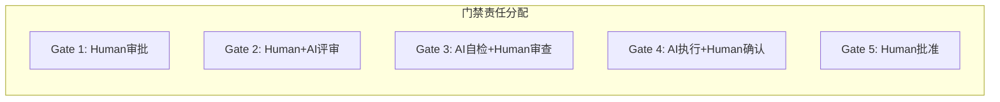
```mermaid
flowchart LR
    subgraph Responsibility["门禁责任分配"]
        direction TB
        G1R[Gate 1: Human审批]
        G2R[Gate 2: Human+AI评审]
        G3R[Gate 3: AI自检+Human审查]
        G4R[Gate 4: AI执行+Human确认]
        G5R[Gate 5: Human批准]
    end
```

---

## Level 2: Container（容器层）- 阶段内迭代机制

### 2.1 Human-AI协作循环

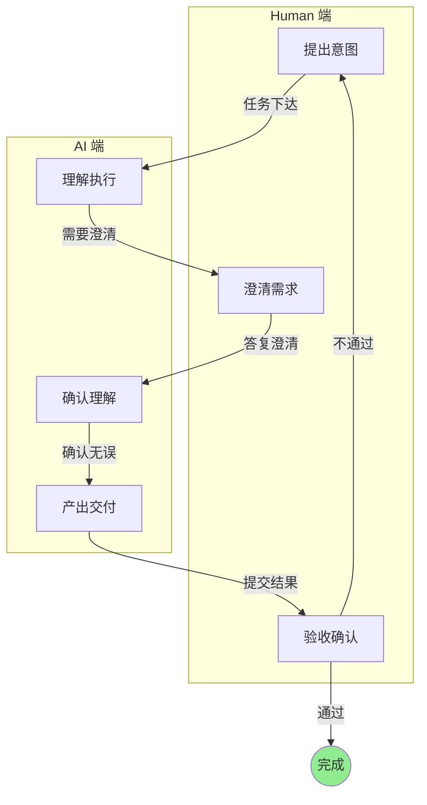
```mermaid
flowchart TB
    subgraph HumanSide["Human 端"]
        H1[提出意图]
        H2[澄清需求]
        H3[验收确认]
    end

    subgraph AISide["AI 端"]
        A1[理解执行]
        A2[确认理解]
        A3[产出交付]
    end

    H1 -->|任务下达| A1
    A1 -->|需要澄清| H2
    H2 -->|答复澄清| A2
    A2 -->|确认无误| A3
    A3 -->|提交结果| H3
    H3 -->|通过| END((完成))
    H3 -->|不通过| H1

    style END fill:#90EE90
```

### 2.2 迭代状态机

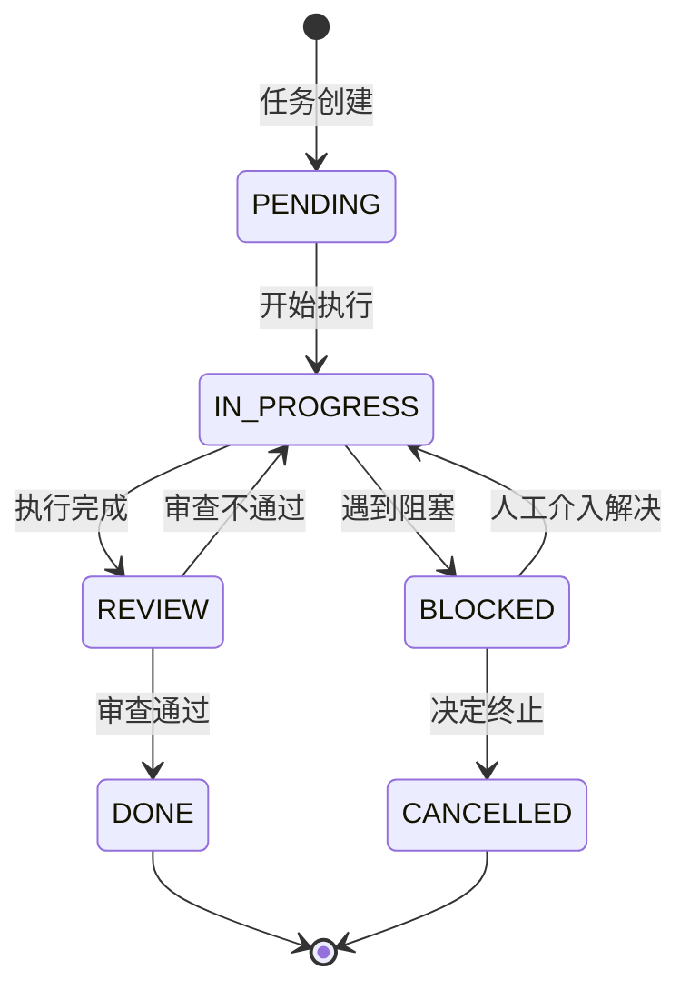
```mermaid
stateDiagram-v2
    [*] --> PENDING: 任务创建

    PENDING --> IN_PROGRESS: 开始执行
    IN_PROGRESS --> REVIEW: 执行完成
    IN_PROGRESS --> BLOCKED: 遇到阻塞

    REVIEW --> DONE: 审查通过
    REVIEW --> IN_PROGRESS: 审查不通过

    BLOCKED --> IN_PROGRESS: 人工介入解决
    BLOCKED --> CANCELLED: 决定终止

    DONE --> [*]
    CANCELLED --> [*]
```

### 2.3 迭代触发条件

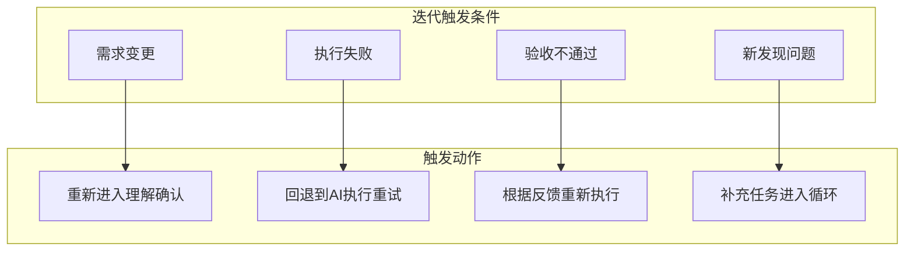
```mermaid
flowchart TB
    subgraph Triggers["迭代触发条件"]
        T1[需求变更]
        T2[执行失败]
        T3[验收不通过]
        T4[新发现问题]
    end

    subgraph Actions["触发动作"]
        A1[重新进入理解确认]
        A2[回退到AI执行重试]
        A3[根据反馈重新执行]
        A4[补充任务进入循环]
    end

    T1 --> A1
    T2 --> A2
    T3 --> A3
    T4 --> A4
```

### 2.4 单阶段完整迭代流程

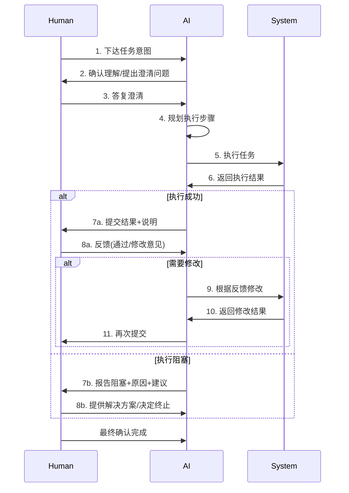
```mermaid
sequenceDiagram
    participant H as Human
    participant A as AI
    participant S as System

    H->>A: 1. 下达任务意图
    A->>H: 2. 确认理解/提出澄清问题
    H->>A: 3. 答复澄清
    A->>A: 4. 规划执行步骤
    A->>S: 5. 执行任务
    S->>A: 6. 返回执行结果

    alt 执行成功
        A->>H: 7a. 提交结果+说明
        H->>A: 8a. 反馈(通过/修改意见)
        alt 需要修改
            A->>S: 9. 根据反馈修改
            S->>A: 10. 返回修改结果
            A->>H: 11. 再次提交
        end
    else 执行阻塞
        A->>H: 7b. 报告阻塞+原因+建议
        H->>A: 8b. 提供解决方案/决定终止
    end

    H->>A: 最终确认完成
```

---

## Level 3: Component（组件层）- Human-AI交互规范

### 3.1 交互协议总览

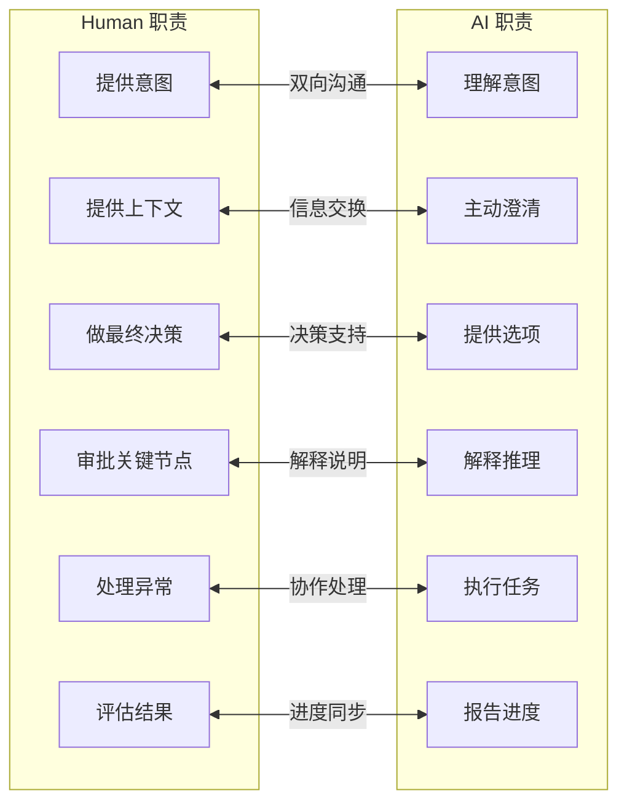
```mermaid
flowchart LR
    subgraph Human["Human 职责"]
        H1[提供意图]
        H2[提供上下文]
        H3[做最终决策]
        H4[审批关键节点]
        H5[处理异常]
        H6[评估结果]
    end

    subgraph AI["AI 职责"]
        A1[理解意图]
        A2[主动澄清]
        A3[提供选项]
        A4[解释推理]
        A5[执行任务]
        A6[报告进度]
    end

    H1 <-->|双向沟通| A1
    H2 <-->|信息交换| A2
    H3 <-->|决策支持| A3
    H4 <-->|解释说明| A4
    H5 <-->|协作处理| A5
    H6 <-->|进度同步| A6
```

### 3.2 需求分析阶段交互

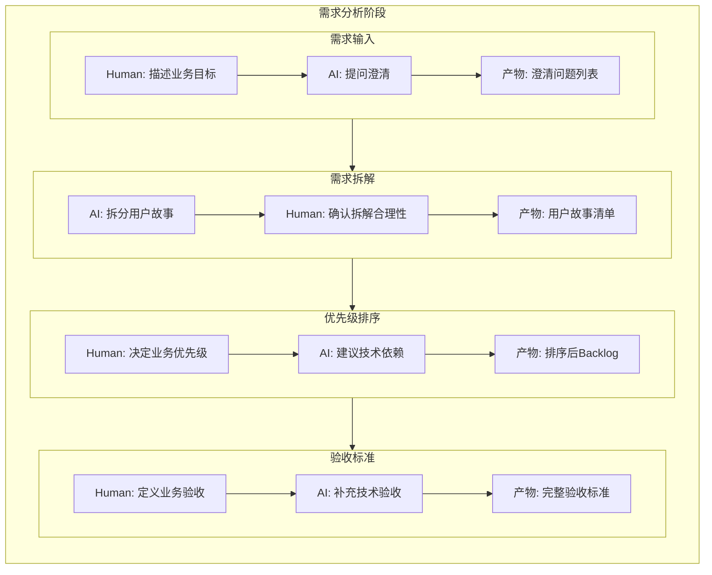
```mermaid
flowchart TB
    subgraph RequirementsPhase["需求分析阶段"]
        direction TB

        subgraph Input["需求输入"]
            HI1[Human: 描述业务目标]
            AI1[AI: 提问澄清]
            O1[产物: 澄清问题列表]
            HI1 --> AI1 --> O1
        end

        subgraph Breakdown["需求拆解"]
            HI2[Human: 确认拆解合理性]
            AI2[AI: 拆分用户故事]
            O2[产物: 用户故事清单]
            AI2 --> HI2 --> O2
        end

        subgraph Priority["优先级排序"]
            HI3[Human: 决定业务优先级]
            AI3[AI: 建议技术依赖]
            O3[产物: 排序后Backlog]
            HI3 --> AI3 --> O3
        end

        subgraph Acceptance["验收标准"]
            HI4[Human: 定义业务验收]
            AI4[AI: 补充技术验收]
            O4[产物: 完整验收标准]
            HI4 --> AI4 --> O4
        end

        Input --> Breakdown --> Priority --> Acceptance
    end
```

### 3.3 设计规划阶段交互

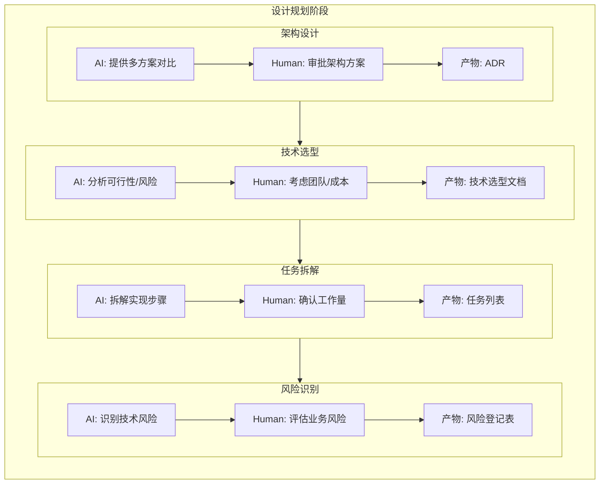
```mermaid
flowchart TB
    subgraph DesignPhase["设计规划阶段"]
        direction TB

        subgraph Arch["架构设计"]
            DA1[AI: 提供多方案对比]
            DH1[Human: 审批架构方案]
            DO1[产物: ADR]
            DA1 --> DH1 --> DO1
        end

        subgraph Tech["技术选型"]
            DA2[AI: 分析可行性/风险]
            DH2[Human: 考虑团队/成本]
            DO2[产物: 技术选型文档]
            DA2 --> DH2 --> DO2
        end

        subgraph Task["任务拆解"]
            DA3[AI: 拆解实现步骤]
            DH3[Human: 确认工作量]
            DO3[产物: 任务列表]
            DA3 --> DH3 --> DO3
        end

        subgraph Risk["风险识别"]
            DA4[AI: 识别技术风险]
            DH4[Human: 评估业务风险]
            DO4[产物: 风险登记表]
            DA4 --> DH4 --> DO4
        end

        Arch --> Tech --> Task --> Risk
    end
```

### 3.4 实现开发阶段交互

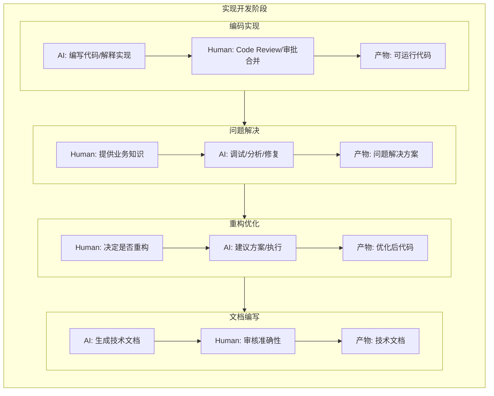
```mermaid
flowchart TB
    subgraph ImplementPhase["实现开发阶段"]
        direction TB

        subgraph Code["编码实现"]
            IA1[AI: 编写代码/解释实现]
            IH1[Human: Code Review/审批合并]
            IO1[产物: 可运行代码]
            IA1 --> IH1 --> IO1
        end

        subgraph Debug["问题解决"]
            IA2[AI: 调试/分析/修复]
            IH2[Human: 提供业务知识]
            IO2[产物: 问题解决方案]
            IH2 --> IA2 --> IO2
        end

        subgraph Refactor["重构优化"]
            IA3[AI: 建议方案/执行]
            IH3[Human: 决定是否重构]
            IO3[产物: 优化后代码]
            IH3 --> IA3 --> IO3
        end

        subgraph Doc["文档编写"]
            IA4[AI: 生成技术文档]
            IH4[Human: 审核准确性]
            IO4[产物: 技术文档]
            IA4 --> IH4 --> IO4
        end

        Code --> Debug --> Refactor --> Doc
    end
```

### 3.5 测试验证阶段交互

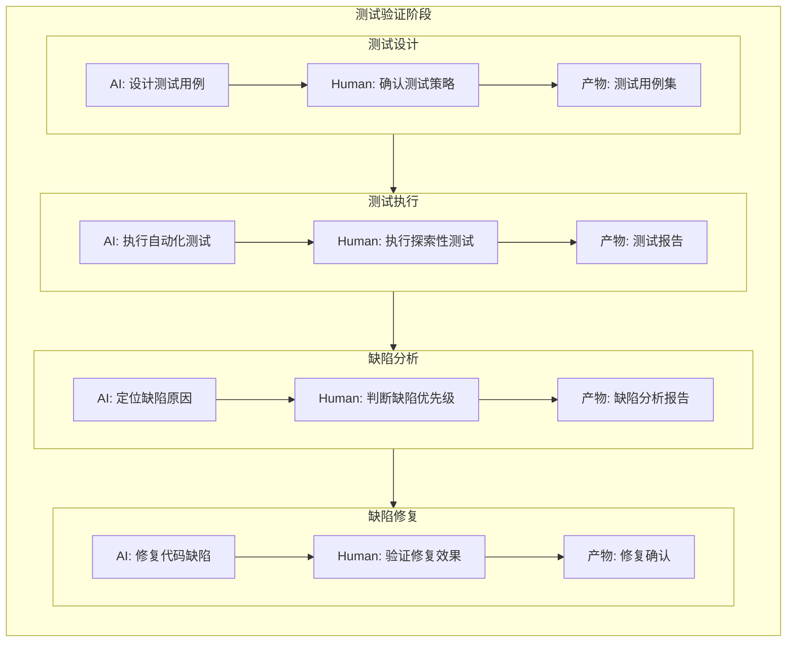
```mermaid
flowchart TB
    subgraph TestPhase["测试验证阶段"]
        direction TB

        subgraph Design["测试设计"]
            TA1[AI: 设计测试用例]
            TH1[Human: 确认测试策略]
            TO1[产物: 测试用例集]
            TA1 --> TH1 --> TO1
        end

        subgraph Execute["测试执行"]
            TA2[AI: 执行自动化测试]
            TH2[Human: 执行探索性测试]
            TO2[产物: 测试报告]
            TA2 --> TH2 --> TO2
        end

        subgraph Analyze["缺陷分析"]
            TA3[AI: 定位缺陷原因]
            TH3[Human: 判断缺陷优先级]
            TO3[产物: 缺陷分析报告]
            TA3 --> TH3 --> TO3
        end

        subgraph Fix["缺陷修复"]
            TA4[AI: 修复代码缺陷]
            TH4[Human: 验证修复效果]
            TO4[产物: 修复确认]
            TA4 --> TH4 --> TO4
        end

        Design --> Execute --> Analyze --> Fix
    end
```

### 3.6 部署运维阶段交互

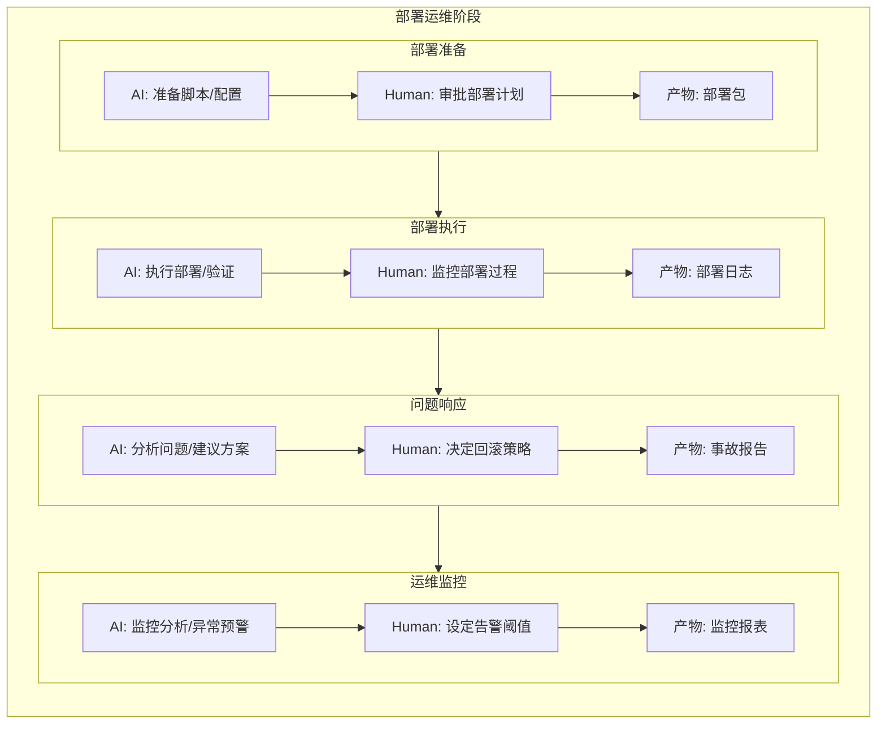
```mermaid
flowchart TB
    subgraph DeployPhase["部署运维阶段"]
        direction TB

        subgraph Prepare["部署准备"]
            PA1[AI: 准备脚本/配置]
            PH1[Human: 审批部署计划]
            PO1[产物: 部署包]
            PA1 --> PH1 --> PO1
        end

        subgraph Deploy["部署执行"]
            PA2[AI: 执行部署/验证]
            PH2[Human: 监控部署过程]
            PO2[产物: 部署日志]
            PA2 --> PH2 --> PO2
        end

        subgraph Incident["问题响应"]
            PA3[AI: 分析问题/建议方案]
            PH3[Human: 决定回滚策略]
            PO3[产物: 事故报告]
            PA3 --> PH3 --> PO3
        end

        subgraph Monitor["运维监控"]
            PA4[AI: 监控分析/异常预警]
            PH4[Human: 设定告警阈值]
            PO4[产物: 监控报表]
            PA4 --> PH4 --> PO4
        end

        Prepare --> Deploy --> Incident --> Monitor
    end
```

---

## Level 4: Code（代码层）- 具体分工与最佳实践

### 4.1 AI必须遵守的规范

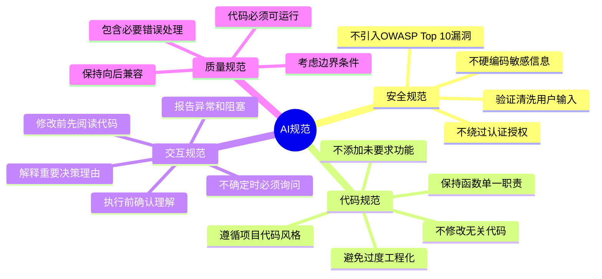
```mermaid
mindmap
  root((AI规范))
    安全规范
      不引入OWASP Top 10漏洞
      不硬编码敏感信息
      不绕过认证授权
      验证清洗用户输入
    代码规范
      遵循项目代码风格
      保持函数单一职责
      避免过度工程化
      不添加未要求功能
      不修改无关代码
    交互规范
      执行前确认理解
      不确定时必须询问
      修改前先阅读代码
      解释重要决策理由
      报告异常和阻塞
    质量规范
      代码必须可运行
      包含必要错误处理
      考虑边界条件
      保持向后兼容
```

### 4.2 AI最佳实践

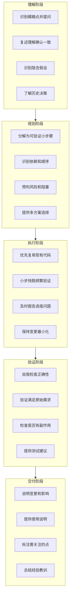
```mermaid
flowchart TB
    subgraph Understand["理解阶段"]
        U1[识别模糊点并提问]
        U2[复述理解确认一致]
        U3[识别隐含假设]
        U4[了解历史决策]
    end

    subgraph Plan["规划阶段"]
        P1[分解为可验证小步骤]
        P2[识别依赖和顺序]
        P3[预判风险和阻塞]
        P4[提供多方案选择]
    end

    subgraph Execute["执行阶段"]
        E1[优先复用现有代码]
        E2[小步快跑频繁验证]
        E3[及时报告进度问题]
        E4[保持变更最小化]
    end

    subgraph Verify["验证阶段"]
        V1[自我检查正确性]
        V2[验证满足原始需求]
        V3[检查是否有副作用]
        V4[提供测试建议]
    end

    subgraph Deliver["交付阶段"]
        D1[说明变更和影响]
        D2[提供使用说明]
        D3[标注需关注的点]
        D4[总结经验教训]
    end

    Understand --> Plan --> Execute --> Verify --> Deliver
```

### 4.3 职责分工矩阵 (RACI)

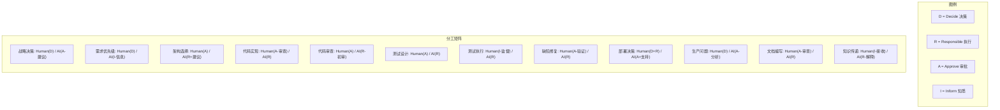
```mermaid
flowchart TB
    subgraph Legend["图例"]
        L1[D = Decide 决策]
        L2[R = Responsible 执行]
        L3[A = Approve 审批]
        L4[I = Inform 知悉]
    end

    subgraph Matrix["分工矩阵"]
        direction TB
        M1["战略决策: Human(D) / AI(A-建议)"]
        M2["需求优先级: Human(D) / AI(I-信息)"]
        M3["架构选择: Human(A) / AI(R+建议)"]
        M4["代码实现: Human(A-审查) / AI(R)"]
        M5["代码审查: Human(A) / AI(R-初审)"]
        M6["测试设计: Human(A) / AI(R)"]
        M7["测试执行: Human(I-监督) / AI(R)"]
        M8["缺陷修复: Human(A-验证) / AI(R)"]
        M9["部署决策: Human(D+R) / AI(A+支持)"]
        M10["生产问题: Human(D) / AI(A-分析)"]
        M11["文档编写: Human(A-审查) / AI(R)"]
        M12["知识传递: Human(I-接收) / AI(R-解释)"]
    end
```

### 4.4 请求-响应交互协议

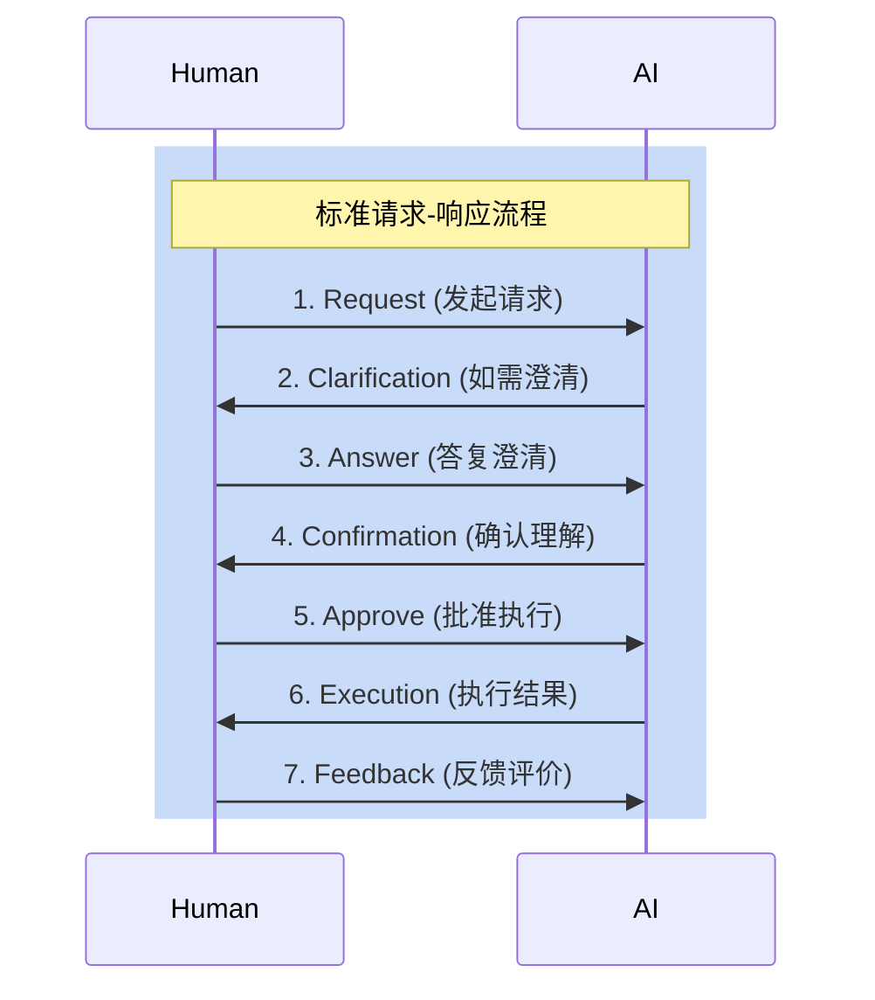
```mermaid
sequenceDiagram
    participant H as Human
    participant A as AI

    rect rgb(200, 220, 250)
        Note over H,A: 标准请求-响应流程
        H->>A: 1. Request (发起请求)
        A->>H: 2. Clarification (如需澄清)
        H->>A: 3. Answer (答复澄清)
        A->>H: 4. Confirmation (确认理解)
        H->>A: 5. Approve (批准执行)
        A->>H: 6. Execution (执行结果)
        H->>A: 7. Feedback (反馈评价)
    end
```

### 4.5 状态报告协议

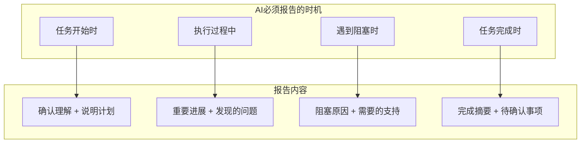
```mermaid
flowchart TB
    subgraph ReportTiming["AI必须报告的时机"]
        direction TB
        R1[任务开始时]
        R2[执行过程中]
        R3[遇到阻塞时]
        R4[任务完成时]
    end

    subgraph ReportContent["报告内容"]
        direction TB
        C1[确认理解 + 说明计划]
        C2[重要进展 + 发现的问题]
        C3[阻塞原因 + 需要的支持]
        C4[完成摘要 + 待确认事项]
    end

    R1 --> C1
    R2 --> C2
    R3 --> C3
    R4 --> C4
```

### 4.6 异常处理协议

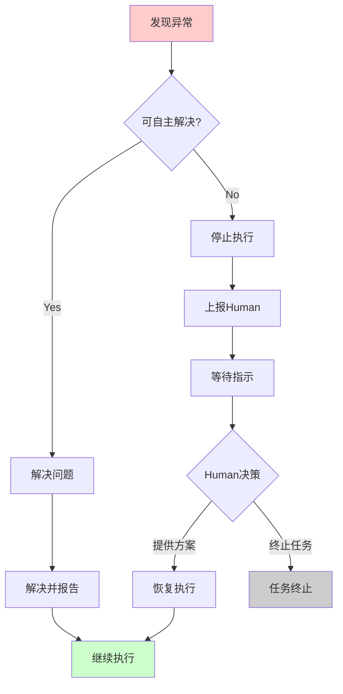
```mermaid
flowchart TB
    Start[发现异常] --> Check{可自主解决?}

    Check -->|Yes| Solve[解决问题]
    Solve --> Report1[解决并报告]
    Report1 --> Continue[继续执行]

    Check -->|No| Stop[停止执行]
    Stop --> Report2[上报Human]
    Report2 --> Wait[等待指示]

    Wait --> Decision{Human决策}
    Decision -->|提供方案| Resume[恢复执行]
    Decision -->|终止任务| End[任务终止]

    Resume --> Continue

    style Start fill:#ffcccc
    style Continue fill:#ccffcc
    style End fill:#cccccc
```

### 4.7 决策升级协议

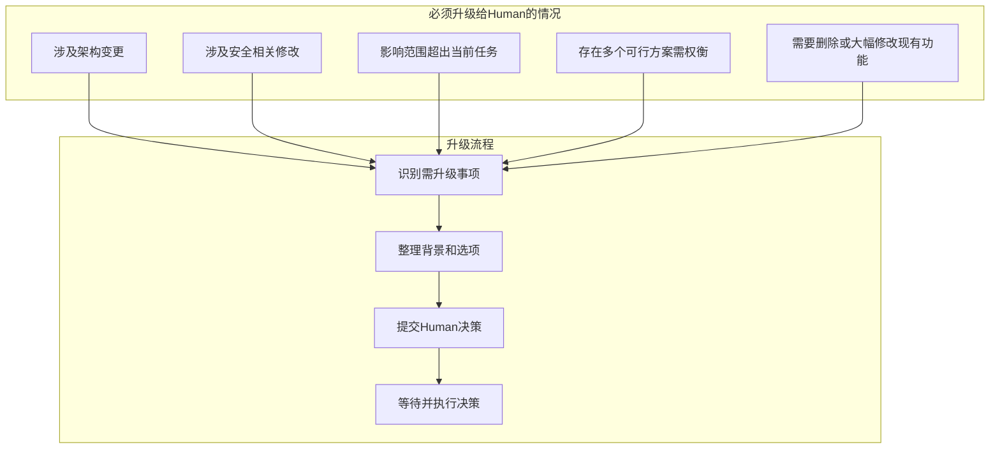
```mermaid
flowchart TB
    subgraph MustEscalate["必须升级给Human的情况"]
        E1[涉及架构变更]
        E2[涉及安全相关修改]
        E3[影响范围超出当前任务]
        E4[存在多个可行方案需权衡]
        E5[需要删除或大幅修改现有功能]
    end

    subgraph EscalateProcess["升级流程"]
        P1[识别需升级事项]
        P2[整理背景和选项]
        P3[提交Human决策]
        P4[等待并执行决策]
    end

    E1 & E2 & E3 & E4 & E5 --> P1
    P1 --> P2 --> P3 --> P4
```

---

## 附录：C4架构层次关系

```mermaid
flowchart TB
    subgraph L1["Level 1: Context 上下文层"]
        L1Q["回答: 整个AIDLC包含哪些阶段?<br/>各阶段如何衔接? 质量如何保证?"]
        L1F["关注: 生命周期全景、阶段划分、质量门禁"]
    end

    subgraph L2["Level 2: Container 容器层"]
        L2Q["回答: 单个阶段内部如何运作?<br/>迭代机制是什么?"]
        L2F["关注: 阶段内迭代循环、状态流转、触发条件"]
    end

    subgraph L3["Level 3: Component 组件层"]
        L3Q["回答: Human和AI如何协作?<br/>各自职责是什么? 交互规则是什么?"]
        L3F["关注: 交互协议、角色职责、各阶段规范"]
    end

    subgraph L4["Level 4: Code 代码层"]
        L4Q["回答: 具体怎么做?<br/>AI必须遵守什么? 最佳实践是什么?"]
        L4F["关注: AI约束规范、最佳实践、具体分工、交互协议细节"]
    end

    L1 -->|深入| L2
    L2 -->|深入| L3
    L3 -->|深入| L4

    style L1 fill:#e1f5fe
    style L2 fill:#b3e5fc
    style L3 fill:#81d4fa
    style L4 fill:#4fc3f7
```

### 层次导航指南

```mermaid
flowchart LR
    subgraph Guide["使用指南"]
        G1["Level 1<br/>做什么 What<br/>全生命周期"]
        G2["Level 2<br/>怎么流转 Flow<br/>迭代机制"]
        G3["Level 3<br/>谁做什么 Who<br/>职责划分"]
        G4["Level 4<br/>怎么做 How<br/>具体执行"]
    end

    G1 --> G2 --> G3 --> G4
```

---

## 快速参考卡片

### Human核心职责

```mermaid
flowchart LR
    H[Human] --> H1[提供意图和上下文]
    H --> H2[做最终决策]
    H --> H3[审批关键节点]
    H --> H4[处理异常情况]
    H --> H5[评估验收结果]
```

### AI核心职责

```mermaid
flowchart LR
    A[AI] --> A1[理解并确认意图]
    A --> A2[主动澄清疑问]
    A --> A3[提供方案选项]
    A --> A4[执行具体任务]
    A --> A5[报告进度状态]
```
