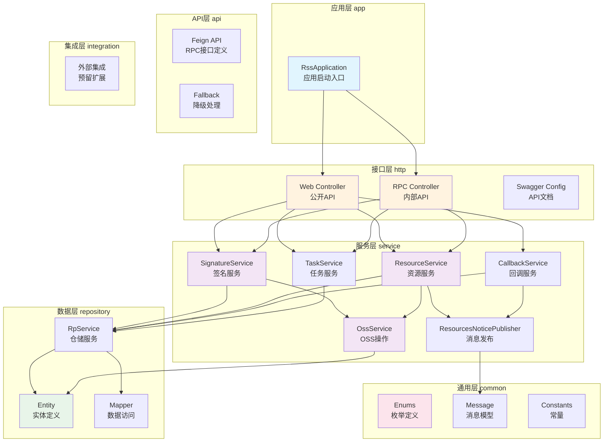
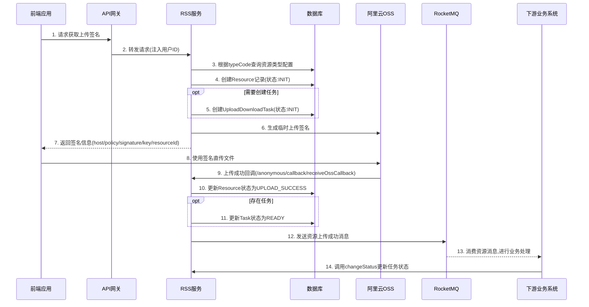
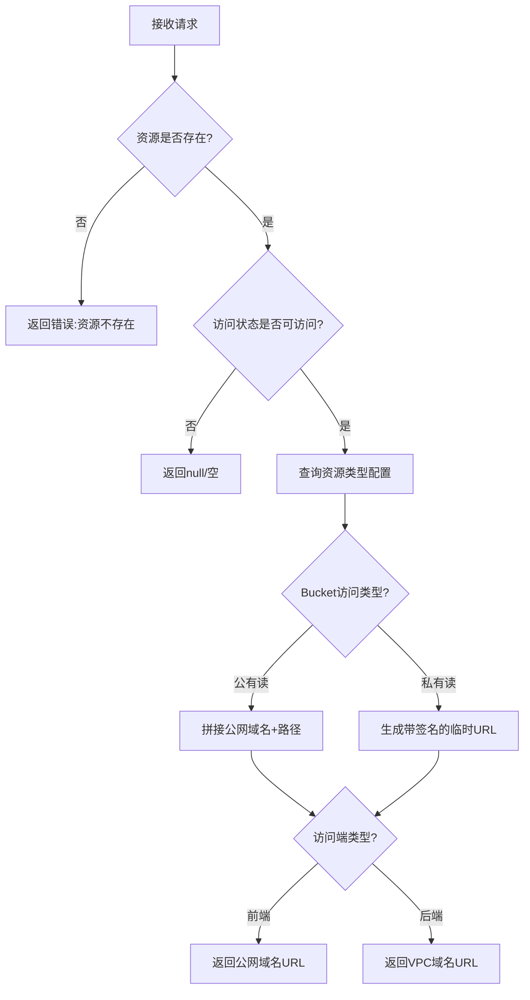
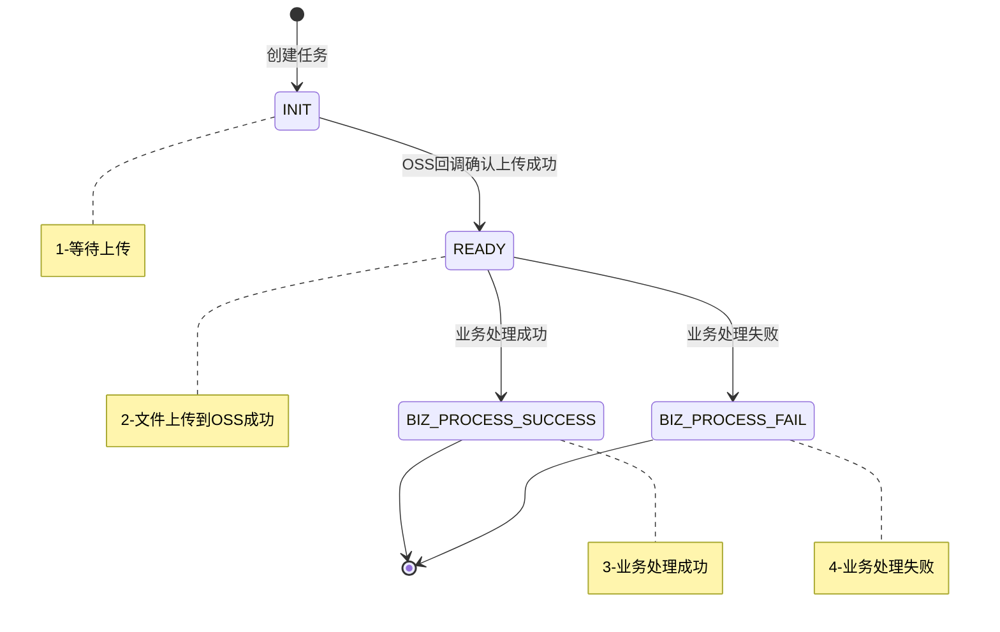
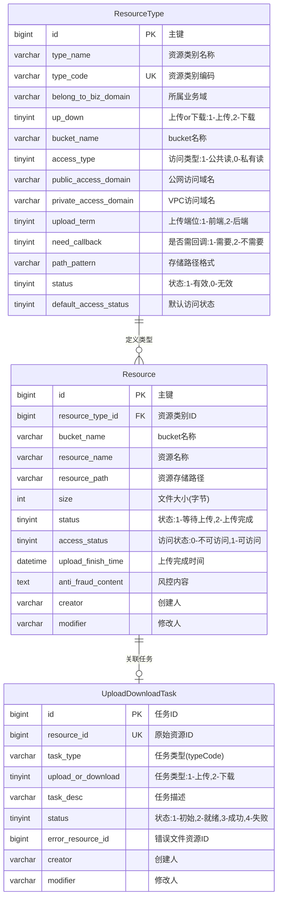
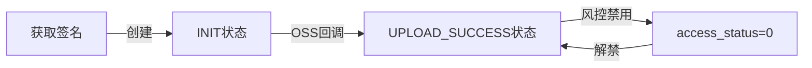

# service-rss 代码仓库分析文档

## 1. 执行摘要

### 系统定位
**资源存储服务（RSS - Resource Storage Service）**：一个统一的文件上传/下载管理平台，对接阿里云OSS，为业务系统提供文件资源的集中化存储、签名授权、访问控制和导入导出任务管理服务。

### 核心能力
1. **文件上传签名管理**：为前端/后端提供OSS直传签名，支持回调确认
2. **资源访问路径生成**：根据资源ID生成临时访问URL，支持公有/私有bucket
3. **资源访问控制**：管理资源的可访问状态，支持风控内容标记
4. **导入导出任务管理**：追踪文件上传/下载任务的完整生命周期
5. **资源消息通知**：通过RocketMQ发布资源状态变更事件

### 技术栈概要
| 项目 | 技术选型 | 版本 |
|------|---------|------|
| 语言 | Java | 1.8 |
| 框架 | Spring Boot | 2.3.7.RELEASE |
| 云框架 | Spring Cloud | Hoxton.SR9 |
| ORM | MyBatis-Plus | 3.4.1 |
| 对象存储 | 阿里云OSS | 3.8.0 |
| 消息队列 | 阿里云RocketMQ | 1.8.7.1.Final |
| 配置中心 | Apollo | 1.8.0 |
| 服务注册 | Nacos | 2.2.1.RELEASE |
| 数据库连接池 | Druid | 1.1.22 |
| API文档 | Swagger | 2.9.2 |

### 关键数字
- **对外接口数**：19个（Web接口10个 + RPC接口9个）
- **核心实体数**：3个（Resource、ResourceType、UploadDownloadTask）
- **主要业务流程**：3个（前端异步上传、服务端上传、资源访问）

---

## 2. 系统能力清单

### 2.1 Web API接口（/public/*）

| 路径 | 方法 | 功能描述 | 典型使用场景 | 所在文件 |
|------|------|----------|--------------|----------|
| `/public/signature/getSignature` | POST | 获取上传文件签名 | 前端获取OSS直传凭证 | `http/.../SignatureController.java:42` |
| `/public/signature/batchGetSignature` | POST | 批量获取上传签名 | 多文件同时上传场景 | `http/.../SignatureController.java:56` |
| `/public/resource/getResourceUrl` | POST | 获取资源访问路径 | 获取文件下载/预览链接 | `http/.../ResourceController.java:50` |
| `/public/resource/getResource` | POST | 获取资源详细信息 | 查看资源元数据 | `http/.../ResourceController.java:63` |
| `/public/resource/batchGetResourceUrls` | POST | 批量获取资源路径 | 列表页展示文件 | `http/.../ResourceController.java:77` |
| `/public/resource/batchGetResources` | POST | 批量获取资源信息 | 批量查询资源详情 | `http/.../ResourceController.java:91` |
| `/public/resource/dumpResource` | POST | 转储外部资源到OSS | 将外部URL资源保存到OSS | `http/.../ResourceController.java:104` |
| `/public/task/page` | POST | 分页查询任务 | 查看导入导出任务列表 | `http/.../TaskController.java:43` |
| `/public/task/getTask` | POST | 根据资源ID查询任务 | 查看任务详情 | `http/.../TaskController.java:58` |
| `/anonymous/callback/receiveOssCallback` | POST | 接收OSS回调 | OSS上传完成后回调 | `http/.../CallbackController.java:36` |

### 2.2 RPC API接口（/private/*）

供其他微服务通过Feign调用：

| 路径 | 方法 | 功能描述 | 典型使用场景 | 所在文件 |
|------|------|----------|--------------|----------|
| `/private/signature/getSignature` | POST | 获取上传签名 | 后端服务获取上传凭证 | `api/.../SignatureApi.java:27` |
| `/private/signature/batchGetSignature` | POST | 批量获取签名 | 批量文件上传 | `api/.../SignatureApi.java:36` |
| `/private/resource/getUrl` | POST | 获取资源路径 | 内部服务获取文件链接 | `api/.../ResourceApi.java:32` |
| `/private/resource/getResource` | POST | 获取资源信息 | 内部服务查询资源 | `api/.../ResourceApi.java:41` |
| `/private/resource/batchGetUrls` | POST | 批量获取路径 | 批量获取下载链接 | `api/.../ResourceApi.java:50` |
| `/private/resource/batchGetResources` | POST | 批量获取资源 | 批量查询资源详情 | `api/.../ResourceApi.java:59` |
| `/private/resource/changeAccessStatus` | POST | 设置访问状态 | 风控审核后禁用资源 | `api/.../ResourceApi.java:68` |
| `/private/resource/dumpResource` | POST | 转储资源 | 内部服务转存文件 | `api/.../ResourceApi.java:77` |
| `/private/task/changeStatus` | POST | 更改任务状态 | 业务处理完成后更新状态 | `api/.../TaskApi.java:29` |
| `/private/task/changeStatusByResourceId` | POST | 按资源ID更改状态 | 通过资源ID更新任务 | `api/.../TaskApi.java:38` |
| `/private/task/updateErrorResourceByTaskId` | POST | 更新错误文件ID | 导入失败后关联错误文件 | `api/.../TaskApi.java:47` |
| `/private/task/updateErrorResourceBySourceId` | POST | 按源ID更新错误文件 | 关联处理结果文件 | `api/.../TaskApi.java:56` |
| `/private/task/getTask` | POST | 查询任务 | 获取任务详情 | `api/.../TaskApi.java:65` |

---

## 3. 功能模块详解

### 3.1 模块划分图



### 3.2 模块详细说明

#### 3.2.1 app 模块
- **业务含义**：应用启动层，Spring Boot应用入口
- **职责边界**：负责应用启动、配置加载、依赖注入容器初始化
- **主要文件**：
  - `RssApplication.java` - 应用启动入口 (`app/src/main/java/.../RssApplication.java:16`)
  - `bootstrap.yml` - 应用配置文件
- **依赖模块**：http

#### 3.2.2 http 模块
- **业务含义**：HTTP接口层，对外暴露RESTful API
- **职责边界**：请求接收、参数校验、响应封装、不包含业务逻辑
- **主要文件**：
  - `web/controller/` - 面向前端的Web API
  - `rpc/controller/` - 面向内部服务的RPC API
  - `config/swagger/` - Swagger文档配置
- **对外接口**：所有HTTP端点
- **依赖模块**：api、service

#### 3.2.3 service 模块
- **业务含义**：业务逻辑层，核心业务处理
- **职责边界**：业务规则实现、事务管理、跨服务协调
- **主要文件**：
  - `signature/` - 签名服务（`SignatureServiceImpl.java`）
  - `resource/` - 资源服务（`ResourceServiceImpl.java`）
  - `callback/` - 回调处理（`CallbackServiceImpl.java`）
  - `task/` - 任务服务（`TaskServiceImpl.java`）
  - `oss/` - OSS操作（`OssServiceImpl.java`）
  - `config/ons/` - RocketMQ配置和消息发布
- **依赖模块**：repository、integration

#### 3.2.4 repository 模块
- **业务含义**：数据访问层，数据库操作封装
- **职责边界**：CRUD操作、数据查询、实体映射
- **主要文件**：
  - `entity/` - 数据实体定义
  - `mapper/` - MyBatis Mapper接口
  - `service/` - 仓储服务实现
- **依赖模块**：common

#### 3.2.5 api 模块
- **业务含义**：API定义层，Feign客户端接口
- **职责边界**：RPC接口定义、请求/响应VO、降级处理
- **主要文件**：
  - `signature/` - 签名API定义
  - `resource/` - 资源API定义
  - `task/` - 任务API定义
- **对外接口**：供其他微服务引用的Feign Client

#### 3.2.6 common 模块
- **业务含义**：公共组件层，通用定义
- **职责边界**：枚举、常量、消息模型等共享定义
- **主要文件**：
  - `enums/` - 业务枚举定义
  - `message/` - 消息体定义
  - `constant/` - 常量定义

---

## 4. 核心业务流程

### 4.1 前端异步上传文件流程

#### 流程概述
- **流程名称**：前端异步上传文件
- **业务目的**：前端直传文件到OSS，减轻服务端带宽压力
- **触发方式**：用户操作（选择文件上传）
- **执行频率**：高频

#### 流程步骤



#### 关键决策点

1. **是否创建任务**（`SignatureServiceImpl.java:71`）
   - 条件：`param.getCreateTask() == true`
   - 含义：导入/导出场景需要追踪处理状态时创建任务

2. **是否需要回调**（`OssServiceImpl.java:135`）
   - 条件：`needCallback == NeedCallbackEnum.NEED`
   - 含义：需要确认上传完成的场景配置回调

#### 涉及的数据变更
- **创建**：Resource记录、UploadDownloadTask记录（可选）
- **更新**：Resource.status、UploadDownloadTask.status

#### 代码路径
- 入口：`SignatureController.getSignature()` (`http/.../SignatureController.java:43`)
- 签名生成：`SignatureServiceImpl.getSignature()` (`service/.../SignatureServiceImpl.java:55`)
- 回调处理：`CallbackServiceImpl.processCallback()` (`service/.../CallbackServiceImpl.java:41`)

---

### 4.2 获取资源访问路径流程

#### 流程概述
- **流程名称**：获取资源访问URL
- **业务目的**：根据资源ID生成可访问的下载/预览链接
- **触发方式**：用户操作/系统调用
- **执行频率**：高频

#### 流程步骤



#### 关键决策点

1. **访问状态检查**（`ResourceServiceImpl.java:66`）
   - 条件：`resource.getAccessStatus() == AccessStatusEnum.NO_ACCESS`
   - 处理：返回null，不生成访问链接

2. **Bucket访问类型**（`OssServiceImpl.java:273`）
   - 公有读：直接拼接域名和路径
   - 私有读：生成带签名的临时URL（有效期10分钟，`OssServiceImpl.java:69`）

3. **访问端类型**（`OssServiceImpl.java:416`）
   - FRONT：使用公网域名
   - BACKEND：使用VPC域名

#### 代码路径
- 入口：`ResourceController.getResourceUrl()` (`http/.../ResourceController.java:51`)
- 服务：`ResourceServiceImpl.getUrl()` (`service/.../ResourceServiceImpl.java:63`)
- OSS操作：`OssServiceImpl.generateTempUrl()` (`service/.../OssServiceImpl.java:113`)

---

### 4.3 任务状态流转流程

#### 状态机



#### 状态流转规则
- **INIT → READY**：仅由OSS回调触发（`CallbackServiceImpl.java:51`）
- **READY → BIZ_PROCESS_SUCCESS/FAIL**：仅允许从READY状态修改（`TaskServiceImpl.java:117`）

---

## 5. 数据模型说明

### 5.1 实体关系图



### 5.2 实体详情

#### ResourceType（资源类型配置）

| 字段名 | 业务含义 | 数据类型 | 约束条件 | 业务规则 |
|--------|----------|----------|----------|----------|
| id | 主键 | BIGINT | NOT NULL, PK | 雪花算法生成 |
| type_name | 类型名称 | VARCHAR(128) | NOT NULL | 如"商品图片"、"导入文件" |
| type_code | 类型编码 | VARCHAR(64) | NOT NULL, UNIQUE | 业务码，如"PRODUCT_IMAGE" |
| belong_to_biz_domain | 所属业务域 | VARCHAR(64) | NOT NULL | 如"商品中心"、"订单中心" |
| up_down | 上传/下载类型 | TINYINT | NOT NULL | 1-上传，2-下载 |
| bucket_name | OSS bucket | VARCHAR(64) | NOT NULL | OSS存储桶名称 |
| access_type | 访问类型 | TINYINT | DEFAULT 0 | 1-公共读，0-私有读 |
| public_access_domain | 公网域名 | VARCHAR(128) | NOT NULL | 如"https://xxx.oss-cn-beijing.aliyuncs.com" |
| private_access_domain | VPC域名 | VARCHAR(128) | NOT NULL | 内网访问域名 |
| upload_term | 上传端位 | TINYINT | NOT NULL | 1-前端WEB，2-后端 |
| need_callback | 是否需回调 | TINYINT | DEFAULT 1 | 1-需要，2-不需要 |
| path_pattern | 路径模式 | VARCHAR(128) | NOT NULL | 支持变量替换，如"product/#bizId#/" |
| status | 状态 | TINYINT | DEFAULT 1 | 1-有效，0-无效 |
| default_access_status | 默认访问状态 | TINYINT | DEFAULT 1 | 新资源的默认访问状态 |

#### Resource（资源）

| 字段名 | 业务含义 | 数据类型 | 约束条件 | 业务规则 |
|--------|----------|----------|----------|----------|
| id | 资源ID | BIGINT | NOT NULL, PK | 雪花算法生成，作为外部引用ID |
| resource_type_id | 资源类型ID | BIGINT | NOT NULL | 关联ResourceType |
| bucket_name | bucket名称 | VARCHAR(64) | NOT NULL | 冗余存储，来自ResourceType |
| resource_name | 资源名称 | VARCHAR(128) | NOT NULL | 原始文件名，最长128字符 |
| resource_path | 存储路径 | VARCHAR(256) | NOT NULL | OSS中的完整对象路径 |
| size | 文件大小 | INT | DEFAULT 0 | 单位：字节，回调时更新 |
| status | 资源状态 | TINYINT | NOT NULL | 1-INIT(等待上传)，2-UPLOAD_SUCCESS(上传完成) |
| access_status | 访问状态 | TINYINT | DEFAULT 1 | 0-不可访问，1-可访问 |
| upload_finish_time | 上传完成时间 | DATETIME | NULL | 回调时更新 |
| anti_fraud_content | 风控内容 | TEXT | NULL | 风控审核结果JSON |
| creator | 创建人 | VARCHAR | NOT NULL | 用户ID |

#### UploadDownloadTask（上传下载任务）

| 字段名 | 业务含义 | 数据类型 | 约束条件 | 业务规则 |
|--------|----------|----------|----------|----------|
| id | 任务ID | BIGINT | NOT NULL, PK | 雪花算法生成 |
| resource_id | 原始资源ID | BIGINT | NOT NULL, UNIQUE | 关联Resource，一对一 |
| task_type | 任务类型 | VARCHAR(64) | NOT NULL | 等于ResourceType.typeCode |
| upload_or_download | 上传/下载 | TINYINT | NOT NULL | 1-上传(导入)，2-下载(导出) |
| task_desc | 任务描述 | VARCHAR(128) | DEFAULT '' | 用户自定义描述 |
| status | 任务状态 | TINYINT | NOT NULL | 1-INIT，2-READY，3-SUCCESS，4-FAIL |
| error_resource_id | 错误文件ID | BIGINT | NULL | 处理失败时的错误结果文件 |
| creator | 创建人 | VARCHAR | NOT NULL | 用户ID |

### 5.3 数据生命周期

#### Resource 生命周期



- **创建**：调用获取签名接口时创建，状态为INIT
- **读取**：通过getResource/getUrl接口，需检查access_status
- **更新**：OSS回调更新status/size，changeAccessStatus更新访问状态
- **删除**：系统不提供删除接口（软禁用而非删除）

#### UploadDownloadTask 生命周期

- **创建**：获取签名时若createTask=true则创建
- **状态更新**：仅允许按状态机规则流转
- **关联更新**：业务处理失败时可更新errorResourceId

---

## 6. 业务规则汇总

### 6.1 显式业务规则

> **规则名称**：资源类型编码校验
> **规则内容**：当获取签名时，typeCode必须存在于resource_type表中
> **业务目的**：防止无效业务码创建资源
> **代码位置**：`service/.../SignatureServiceImpl.java:61`
> **违反后果**：抛出异常"无效的资源类型编码"

> **规则名称**：路径参数完整性校验
> **规则内容**：当path_pattern中包含`#param#`变量时，pathParam必须提供对应值
> **业务目的**：确保资源路径正确生成
> **代码位置**：`service/.../SignatureServiceImpl.java:108`
> **违反后果**：抛出异常"渲染资源路径的业务参数不完整"

> **规则名称**：资源访问状态检查
> **规则内容**：当资源access_status=0(不可访问)时，getUrl返回null
> **业务目的**：风控禁用后阻止访问
> **代码位置**：`service/.../ResourceServiceImpl.java:66`
> **违反后果**：返回null，记录日志

> **规则名称**：任务状态流转限制
> **规则内容**：仅允许从READY状态修改为BIZ_PROCESS_SUCCESS或BIZ_PROCESS_FAIL
> **业务目的**：保证状态机完整性
> **代码位置**：`service/.../TaskServiceImpl.java:113-117`
> **违反后果**：抛出异常"待修改的状态不合法"或"仅允许修改处于就绪状态的任务状态"

> **规则名称**：文件名长度限制
> **规则内容**：resourceName不能超过128个字符
> **业务目的**：数据库字段长度约束
> **代码位置**：`http/.../GetSignatureRequest.java:27`
> **违反后果**：校验失败"文件名称不能大于128个字符串"

### 6.2 隐式业务规则

1. **签名有效期**：上传签名有效期为300秒（`OssServiceImpl.java:146`）
2. **临时URL有效期**：私有bucket资源访问URL有效期为600秒（`OssServiceImpl.java:69`）
3. **资源路径格式**：`{pathPattern}/{UUID}/{resourceName}`（`SignatureServiceImpl.java:120`）
4. **资源ID生成**：使用MyBatis-Plus雪花算法（ASSIGN_ID）
5. **消息Tag**：使用resourceTypeCode作为RocketMQ消息Tag（`ResourcesNoticePublisher.java:53`）

### 6.3 枚举值定义

| 枚举类型 | 值 | 含义 |
|---------|-----|------|
| ResourceStatusEnum | 1-INIT | 等待上传 |
| | 2-UPLOAD_SUCCESS | 上传完成 |
| AccessStatusEnum | 0-NO_ACCESS | 不可访问 |
| | 1-ACCESS | 可访问 |
| AccessTypeEnum | 0-PRIVATE | 私有读 |
| | 1-PUBLIC | 公共读 |
| UpDownEnum | 1-UPLOAD | 上传 |
| | 2-DOWNLOAD | 下载 |
| AccessTermEnum | 1-FRONT | 前端 |
| | 2-BACKEND | 后端 |
| NeedCallbackEnum | 1-NEED | 需要回调 |
| | 2-NO | 不需要回调 |
| UpDownTaskStatusEnum | 1-INIT | 初始状态 |
| | 2-READY | 资源就绪 |
| | 3-BIZ_PROCESS_SUCCESS | 业务处理成功 |
| | 4-BIZ_PROCESS_FAIL | 业务处理失败 |

---

## 7. 集成与扩展

### 7.1 外部系统集成

| 外部系统 | 集成方式 | 用途 | 配置位置 | 失败处理 |
|----------|----------|------|----------|----------|
| 阿里云OSS | SDK | 文件存储、签名生成 | Apollo(oss namespace) | 返回错误/null |
| 阿里云RocketMQ | SDK | 消息发布 | Apollo(rocketmq namespace) | 记录错误日志 |
| Apollo | SDK | 配置中心 | bootstrap.yml:17-20 | 启动失败 |
| Nacos | SDK | 服务注册发现 | Apollo(nacos namespace) | 服务不可用 |

### 7.2 事件与消息

#### 发布的消息

| Topic | Tag | 触发时机 | 消息内容 | 消费者 |
|-------|-----|----------|----------|--------|
| resourceNoticeTopic | {resourceTypeCode} | 资源上传成功、访问状态变更 | ResourceMessage | 下游业务系统 |

**ResourceMessage结构**：
```json
{
  "id": 123456789,
  "resourceName": "导入文件.xlsx",
  "resourceTypeId": 100,
  "resourceTypeName": "商品导入",
  "resourceTypeCode": "PRODUCT_IMPORT",
  "size": 10240,
  "status": "UPLOAD_SUCCESS",
  "accessStatus": "ACCESS",
  "antiFraudContent": null
}
```

### 7.3 扩展机制

1. **资源类型配置化**：通过resource_type表配置新业务场景
2. **路径模式变量**：pathPattern支持`#variable#`变量替换
3. **消息Tag路由**：消费者可按resourceTypeCode订阅特定类型消息

---

## 8. 附录

### 8.1 配置项说明

| 配置项 | 用途 | 默认值 | 配置位置 |
|--------|------|--------|----------|
| server.port | 服务端口 | 7000 | bootstrap.yml:12 |
| oss.accessKey | OSS访问密钥 | - | Apollo(oss) |
| oss.accessSecret | OSS访问密钥 | - | Apollo(oss) |
| oss.priEndpoint | OSS私网端点 | - | Apollo(oss) |
| oss.pubEndpoint | OSS公网端点 | - | Apollo(oss) |
| oss.callbackUrl | OSS回调地址 | - | Apollo(oss) |
| rocketmq.common.accessKey | MQ访问密钥 | - | Apollo(rocketmq) |
| rocketmq.common.nameSrvAddr | MQ服务地址 | - | Apollo(rocketmq) |
| rocketmq.biz.resourceNoticeTopic | 资源消息Topic | - | Apollo(rocketmq) |

### 8.2 环境配置

支持多环境部署（`bootstrap.yml:36-77`）：
- local：本地开发
- dev：开发环境
- test：测试环境
- uat：用户验收测试
- gray：灰度环境
- prod：生产环境

### 8.3 API分组说明

接口路径前缀含义：
- `/public/*` - 需要网关鉴权，网关注入用户上下文
- `/private/*` - 内部RPC调用，不经过网关
- `/anonymous/*` - 匿名访问，OSS回调使用

---

## 9. 分析总结

这是一个**统一资源存储服务（RSS）**，核心解决的问题是：
1. 各业务系统独立对接OSS带来的维护成本
2. 文件上传签名、回调处理的重复开发
3. 资源访问控制和风控审核的统一管理
4. 导入导出任务状态的全生命周期追踪

**架构特点**：
- 采用经典的分层架构（app → http → service → repository）
- 通过Feign定义RPC接口，供其他微服务调用
- 使用Apollo配置中心管理多环境配置
- 通过RocketMQ实现资源状态变更的事件通知

**关键业务能力**：
1. **签名服务**：为前端/后端生成OSS直传签名，支持配置化的路径模式
2. **资源服务**：管理资源的访问URL生成、访问控制、外部资源转储
3. **回调服务**：处理OSS上传完成回调，更新资源状态并发布消息
4. **任务服务**：追踪导入导出任务的完整生命周期

---

*文档生成时间：2025-12-02*
*分析工具：Claude Code*
