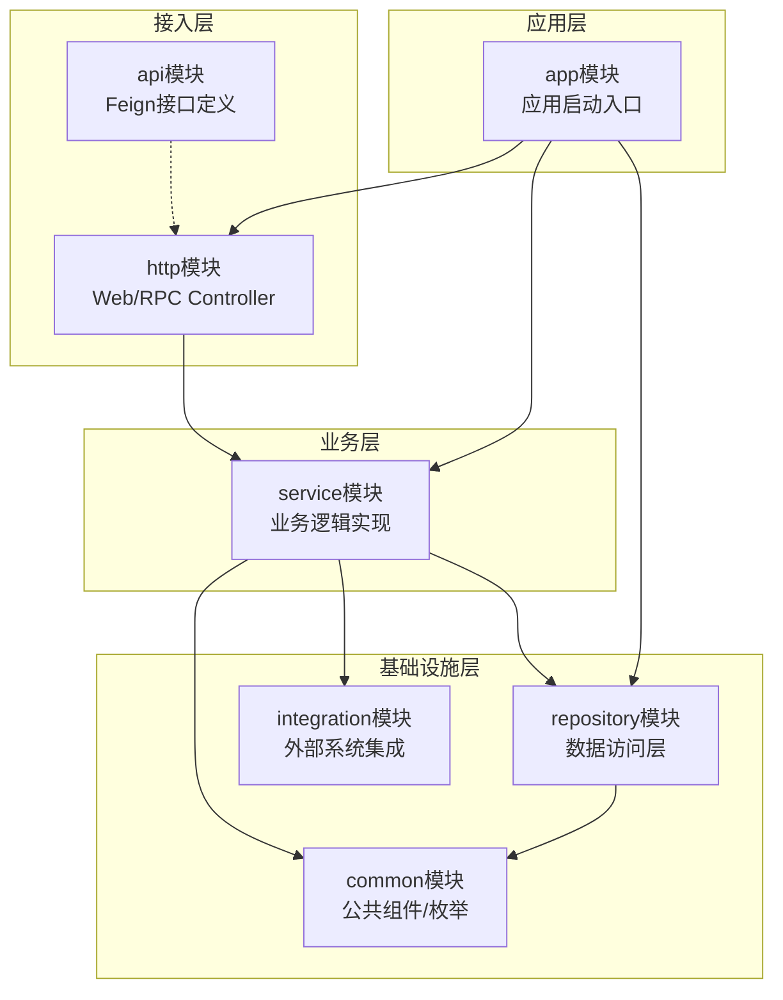
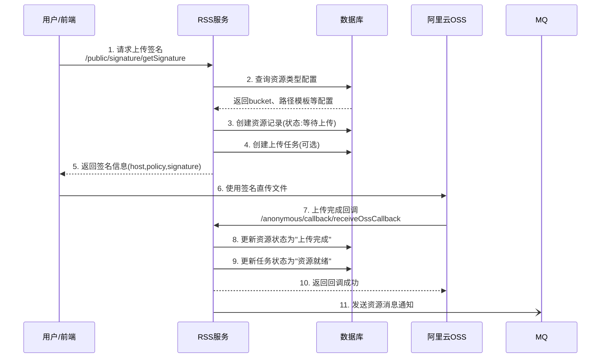
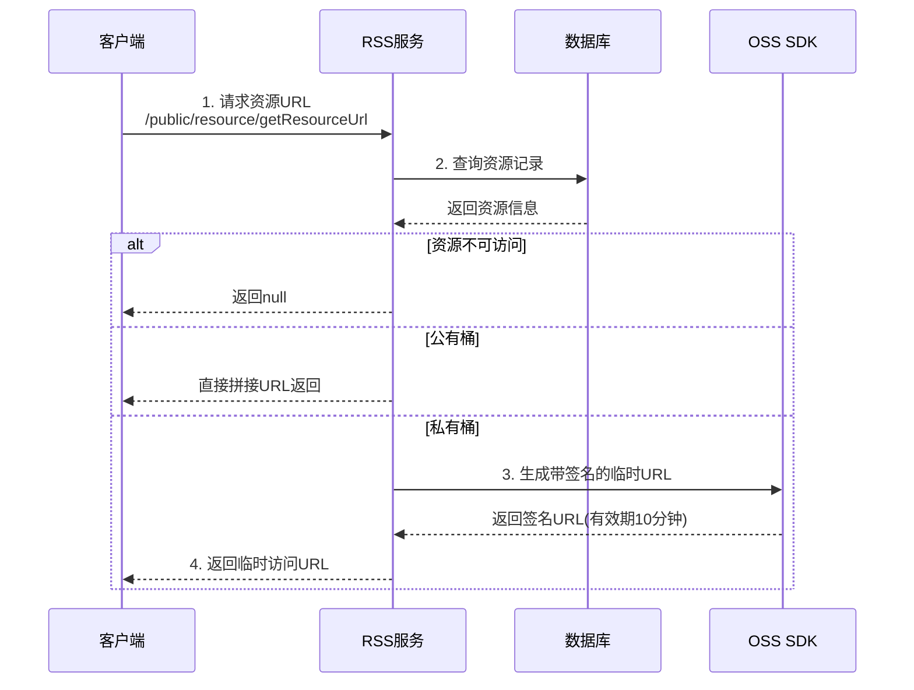
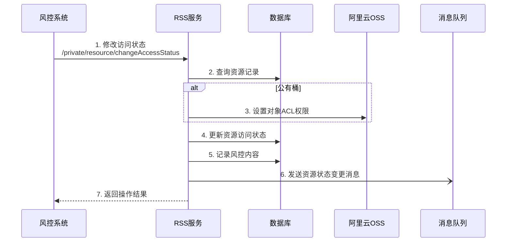
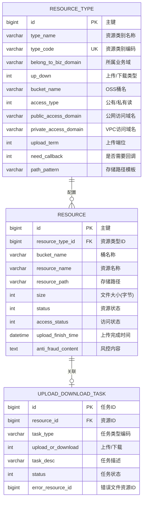
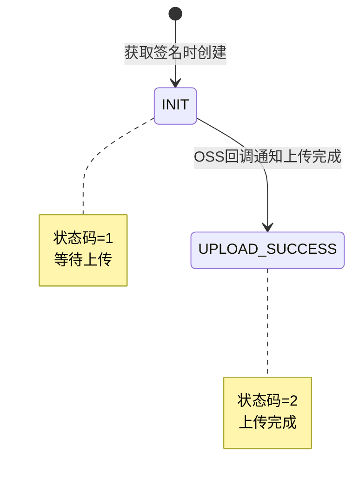
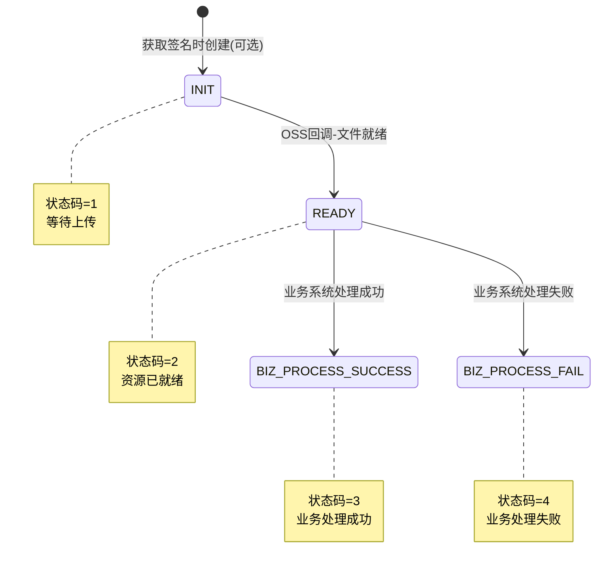

# service-rss 代码仓库分析报告

---

## 1. 执行摘要

### 系统定位
**RSS（Resource Storage Service）是一个统一的资源存储服务**，为企业内部各业务系统提供文件上传、下载、存储管理的中台能力，底层对接阿里云OSS（Object Storage Service，对象存储服务）。

### 核心能力
1. **文件上传签名管理** - 生成前端直传OSS所需的临时授权签名
2. **资源访问路径生成** - 为私有/公有存储桶生成带有效期的访问URL
3. **文件导入导出任务管理** - 跟踪文件处理任务的状态流转
4. **资源访问权限控制** - 支持公有读/私有读的权限切换
5. **资源转储能力** - 将外部URL资源转储到OSS

### 技术栈概要
- **语言**: Java 8
- **框架**: Spring Boot 2.3.7 + Spring Cloud Hoxton.SR9
- **数据库**: MySQL + MyBatis-Plus 3.4.1 + Druid连接池
- **对象存储**: 阿里云OSS 3.8.0
- **消息队列**: 阿里云RocketMQ (ONS Client 1.8.7.1)
- **服务注册**: Nacos
- **配置中心**: Apollo
- **API文档**: Swagger 2.9.2

### 关键数字
| 指标 | 数量 |
|------|------|
| API端点数 | 20个 |
| 数据实体数 | 3个 |
| 核心业务流程数 | 3个 |
| 模块数 | 7个 |

---

## 2. 系统能力清单

### 2.1 对外接口 - Web层（面向前端/外部调用）

| 路径 | 方法 | 功能描述 | 典型使用场景 | 所在文件:行号 |
|------|------|----------|--------------|---------------|
| `/` | GET | 服务健康检查首页 | 检查服务是否存活 | `http/src/.../index/IndexController.java:27` |
| `/public/signature/getSignature` | POST | 获取文件上传签名 | 前端上传文件前获取授权 | `http/src/.../signature/SignatureController.java:42` |
| `/public/signature/batchGetSignature` | POST | 批量获取文件上传签名 | 批量上传多个文件 | `http/src/.../signature/SignatureController.java:56` |
| `/public/resource/getResourceUrl` | POST | 获取单个资源访问URL | 展示用户已上传的图片/文件 | `http/src/.../resource/ResourceController.java:50` |
| `/public/resource/getResource` | POST | 获取资源详细信息 | 获取文件名、大小等元数据 | `http/src/.../resource/ResourceController.java:63` |
| `/public/resource/batchGetResourceUrls` | POST | 批量获取资源访问URL | 列表页批量展示文件 | `http/src/.../resource/ResourceController.java:77` |
| `/public/resource/batchGetResources` | POST | 批量获取资源信息 | 批量获取文件详情 | `http/src/.../resource/ResourceController.java:91` |
| `/public/resource/dumpResource` | POST | 转储外部资源到OSS | 保存第三方图片到自有存储 | `http/src/.../resource/ResourceController.java:105` |
| `/public/task/page` | POST | 分页查询导入导出任务 | 查看用户的导入/导出历史 | `http/src/.../task/TaskController.java:42` |
| `/public/task/getTask` | POST | 根据资源ID查询任务 | 查看某次导入的处理状态 | `http/src/.../task/TaskController.java:58` |
| `/anonymous/callback/receiveOssCallback` | POST | 接收OSS上传回调 | OSS文件上传完成后通知系统 | `http/src/.../callback/CallbackController.java:35` |

### 2.2 对外接口 - RPC层（面向内部微服务调用）

| 路径 | 方法 | 功能描述 | 典型使用场景 | 所在文件:行号 |
|------|------|----------|--------------|---------------|
| `/private/signature/getSignature` | POST | 获取上传签名(RPC) | 后端服务获取上传授权 | `http/src/.../rpc/.../SignatureApiController.java:43` |
| `/private/signature/batchGetSignature` | POST | 批量获取签名(RPC) | 后端批量上传场景 | `http/src/.../rpc/.../SignatureApiController.java:57` |
| `/private/resource/getUrl` | POST | 获取资源URL(RPC) | 后端服务获取文件URL | `http/src/.../rpc/.../ResourceApiController.java:53` |
| `/private/resource/getResource` | POST | 获取资源信息(RPC) | 后端获取文件详情 | `http/src/.../rpc/.../ResourceApiController.java:66` |
| `/private/resource/batchGetUrls` | POST | 批量获取URL(RPC) | 后端批量获取文件URL | `http/src/.../rpc/.../ResourceApiController.java:80` |
| `/private/resource/batchGetResources` | POST | 批量获取资源(RPC) | 后端批量获取文件详情 | `http/src/.../rpc/.../ResourceApiController.java:93` |
| `/private/resource/changeAccessStatus` | POST | 修改资源访问状态 | 风控禁用/启用某资源访问 | `http/src/.../rpc/.../ResourceApiController.java:107` |
| `/private/resource/dumpResource` | POST | 转储资源(RPC) | 后端转储第三方文件 | `http/src/.../rpc/.../ResourceApiController.java:121` |
| `/private/task/changeStatus` | POST | 更改任务状态 | 标记导入任务处理完成 | `http/src/.../rpc/.../TaskApiController.java:47` |
| `/private/task/changeStatusByResourceId` | POST | 按资源ID更改任务状态 | 根据文件ID更新任务状态 | `http/src/.../rpc/.../TaskApiController.java:60` |
| `/private/task/updateErrorResourceByTaskId` | POST | 更新任务错误文件ID | 导入失败后关联错误报告 | `http/src/.../rpc/.../TaskApiController.java:73` |
| `/private/task/updateErrorResourceBySourceId` | POST | 按源资源ID更新错误文件 | 根据原文件ID关联错误报告 | `http/src/.../rpc/.../TaskApiController.java:86` |
| `/private/task/getTask` | POST | 查询任务详情(RPC) | 后端查询任务处理结果 | `http/src/.../rpc/.../TaskApiController.java:99` |

---

## 3. 功能模块详解

### 3.1 模块关系图

### 3.2 各模块详细说明

#### 模块：app

**业务含义**：应用启动模块，负责整合所有子模块并启动Spring Boot应用

**职责边界**：
- ✅ 负责：应用启动配置、环境配置、资源配置
- ❌ 不负责：任何业务逻辑处理

**核心文件**：
- `app/src/main/java/com/befriend/rss/RssApplication.java:16` - 应用启动入口
- `app/src/main/resources/bootstrap.yml:1` - Spring Cloud引导配置
- `app/src/main/resources/application.properties:1` - 应用配置

---

#### 模块：http

**业务含义**：HTTP接入层，提供Web和RPC两套API入口，处理请求路由和参数转换

**职责边界**：
- ✅ 负责：请求接收、参数校验、响应封装、Swagger文档
- ❌ 不负责：业务逻辑处理、数据库操作

**核心文件**：
- `http/src/.../web/controller/signature/SignatureController.java` - 签名Web接口
- `http/src/.../web/controller/resource/ResourceController.java` - 资源Web接口
- `http/src/.../web/controller/callback/CallbackController.java` - OSS回调接口
- `http/src/.../rpc/controller/` - RPC接口控制器目录

**对外接口**：
- Web层: `/public/*` 和 `/anonymous/*` 路径
- RPC层: `/private/*` 路径

---

#### 模块：service

**业务含义**：核心业务逻辑层，实现签名生成、资源管理、任务处理等核心能力

**职责边界**：
- ✅ 负责：签名生成、URL构建、OSS交互、任务状态流转、消息发送
- ❌ 不负责：HTTP协议处理、数据库直接操作

**核心文件**：
- `service/src/.../signature/impl/SignatureServiceImpl.java:34` - 签名服务实现
- `service/src/.../resource/impl/ResourceServiceImpl.java:44` - 资源服务实现
- `service/src/.../callback/impl/CallbackServiceImpl.java:25` - 回调处理实现
- `service/src/.../oss/impl/OssServiceImpl.java:55` - OSS操作服务

**对外接口**：
- `SignatureService.getSignature()` - 生成上传签名 @ `service/src/.../signature/SignatureService.java:20`
- `ResourceService.getUrl()` - 获取资源URL @ `service/src/.../resource/ResourceService.java:25`
- `CallbackService.processCallback()` - 处理OSS回调 @ `service/src/.../callback/CallbackService.java:16`

---

#### 模块：repository

**业务含义**：数据访问层，封装数据库操作，使用MyBatis-Plus实现CRUD

**职责边界**：
- ✅ 负责：数据库读写、实体映射、查询条件封装
- ❌ 不负责：业务逻辑判断

**核心文件**：
- `repository/src/.../entity/Resource.java:26` - 资源实体
- `repository/src/.../entity/ResourceType.java:30` - 资源类型实体
- `repository/src/.../entity/UploadDownloadTask.java:26` - 上传下载任务实体

---

#### 模块：api

**业务含义**：对外暴露的Feign客户端接口定义，供其他微服务调用

**职责边界**：
- ✅ 负责：定义RPC接口契约、请求/响应模型、降级处理
- ❌ 不负责：接口实现

**核心文件**：
- `api/src/.../signature/SignatureApi.java:19` - 签名服务Feign接口
- `api/src/.../resource/ResourceApi.java:24` - 资源服务Feign接口
- `api/src/.../task/TaskApi.java:21` - 任务服务Feign接口

---

#### 模块：common

**业务含义**：公共组件模块，包含枚举定义、常量、通用工具类

**职责边界**：
- ✅ 负责：枚举定义、常量定义、公共工具
- ❌ 不负责：业务逻辑

**核心文件**：
- `common/src/.../enums/ResourceStatusEnum.java:11` - 资源状态枚举
- `common/src/.../enums/UpDownTaskStatusEnum.java:11` - 任务状态枚举
- `common/src/.../enums/AccessTypeEnum.java:9` - 访问类型枚举

---

#### 模块：integration

**业务含义**：外部系统集成模块，封装与第三方系统的交互

**职责边界**：
- ✅ 负责：外部系统客户端封装
- ❌ 不负责：业务逻辑

---

## 4. 核心业务流程

### 4.1 流程：前端异步上传文件

**业务目的**：允许前端直接上传文件到OSS，减轻服务端压力，提升上传效率

**触发方式**：用户操作（选择文件后触发上传）

**执行频率**：高频（用户每次上传文件都会触发）

#### 流程图

#### 关键决策点

| 决策点 | 条件 | 处理逻辑 | 代码位置 |
|--------|------|----------|----------|
| 是否创建任务 | `param.getCreateTask()` 为 true | 创建上传/下载任务记录 | `service/src/.../signature/impl/SignatureServiceImpl.java:71` |
| 是否需要回调 | 资源类型配置 `needCallback` | 在签名中加入回调参数 | `service/src/.../oss/impl/OssServiceImpl.java:135` |

#### 数据变更
- **创建**：`resource` 表（资源记录）、`upload_download_task` 表（任务记录，可选）
- **更新**：`resource.status` → UPLOAD_SUCCESS、`upload_download_task.status` → READY

#### 代码路径
`SignatureController.java:43` → `SignatureServiceImpl.java:55` → `OssServiceImpl.java:128` → `ResourceRpService.save()`

---

### 4.2 流程：获取资源访问URL

**业务目的**：为已上传的资源生成临时访问URL，支持公有桶直接访问和私有桶签名访问

**触发方式**：用户操作 / 系统触发

**执行频率**：高频

#### 流程图

#### 关键决策点

| 决策点 | 条件 | 处理逻辑 | 代码位置 |
|--------|------|----------|----------|
| 访问状态检查 | `resource.accessStatus == NO_ACCESS` | 返回null拒绝访问 | `service/src/.../resource/impl/ResourceServiceImpl.java:66` |
| 桶类型判断 | `resourceType.accessType == PRIVATE` | 私有桶需生成签名URL | `service/src/.../oss/impl/OssServiceImpl.java:273` |
| 访问端位 | `accessTerm == FRONT` | 使用公网域名 | `service/src/.../oss/impl/OssServiceImpl.java:417` |

#### 代码路径
`ResourceController.java:51` → `ResourceServiceImpl.java:63` → `OssServiceImpl.java:113`

---

### 4.3 流程：修改资源访问状态（风控场景）

**业务目的**：支持风控系统禁用违规资源的访问，或恢复误封资源

**触发方式**：系统触发（风控回调）

**执行频率**：低频

#### 流程图

#### 数据变更
- **更新**：`resource.access_status`、`resource.anti_fraud_content`

#### 外部依赖

| 依赖服务 | 调用方式 | 失败处理 |
|----------|----------|----------|
| 阿里云OSS | SDK调用 | 抛出异常 |
| RocketMQ | 异步消息 | 日志记录 |

---

## 5. 数据模型说明

### 5.1 实体关系图

### 5.2 实体详情

#### resource_type（资源类型配置表）

| 字段名 | 业务含义 | 数据类型 | 约束条件 | 业务规则 | 定义位置 |
|--------|----------|----------|----------|----------|----------|
| id | 资源类型唯一标识 | bigint | PK, NOT NULL | 雪花算法生成 | `repository/src/.../entity/ResourceType.java:36` |
| type_name | 资源类别名称 | varchar(128) | NOT NULL | 显示用途 | `ResourceType.java:39` |
| type_code | 资源类别编码 | varchar(64) | UNIQUE | 业务系统调用时的标识 | `ResourceType.java:42` |
| belong_to_biz_domain | 所属业务域 | varchar(64) | NOT NULL | 区分不同业务系统 | `ResourceType.java:45` |
| up_down | 上传/下载类型 | tinyint | 1=上传,2=下载 | 决定任务类型 | `ResourceType.java:48` |
| bucket_name | OSS桶名 | varchar(64) | NOT NULL | 存储位置标识 | `ResourceType.java:51` |
| access_type | 访问类型 | int | 0=私有,1=公有 | 决定URL生成策略 | `ResourceType.java:54` |
| public_access_domain | 公网域名 | varchar(128) | NOT NULL | 前端访问使用 | `ResourceType.java:57` |
| private_access_domain | VPC域名 | varchar(128) | NOT NULL | 后端访问使用 | `ResourceType.java:60` |
| path_pattern | 路径模板 | varchar(128) | NOT NULL | 支持#param#变量替换 | `ResourceType.java:69` |

#### resource（资源表）

| 字段名 | 业务含义 | 数据类型 | 约束条件 | 业务规则 | 定义位置 |
|--------|----------|----------|----------|----------|----------|
| id | 资源唯一标识 | bigint | PK | 雪花算法，创建后不变 | `repository/src/.../entity/Resource.java:32` |
| resource_type_id | 关联资源类型 | bigint | FK | 引用resource_type.id | `Resource.java:35` |
| bucket_name | 存储桶名 | varchar(64) | NOT NULL | 从资源类型复制 | `Resource.java:38` |
| resource_name | 资源原始名称 | varchar(128) | NOT NULL | 用户上传时的文件名 | `Resource.java:41` |
| resource_path | OSS存储路径 | varchar(256) | NOT NULL | 含UUID，全局唯一 | `Resource.java:44` |
| size | 文件大小 | int | 默认0 | 回调时更新，单位字节 | `Resource.java:47` |
| status | 资源状态 | tinyint | 1=等待上传,2=上传完成 | 状态流转见下方状态机 | `Resource.java:50` |
| access_status | 访问状态 | tinyint | 0=不可访问,1=可访问 | 风控可禁用 | `Resource.java:53` |
| anti_fraud_content | 风控内容 | text | 可空 | 记录风控判定结果 | `Resource.java:59` |

#### upload_download_task（上传下载任务表）

| 字段名 | 业务含义 | 数据类型 | 约束条件 | 业务规则 | 定义位置 |
|--------|----------|----------|----------|----------|----------|
| id | 任务唯一标识 | bigint | PK | 雪花算法 | `repository/src/.../entity/UploadDownloadTask.java:31` |
| resource_id | 关联资源ID | bigint | UNIQUE | 一个资源最多一个任务 | `UploadDownloadTask.java:35` |
| task_type | 任务类型编码 | varchar(64) | NOT NULL | 对应resource_type.type_code | `UploadDownloadTask.java:38` |
| upload_or_download | 上传/下载 | tinyint | 1=上传,2=下载 | 区分导入/导出 | `UploadDownloadTask.java:41` |
| status | 任务状态 | tinyint | 1-4 | 见下方状态机 | `UploadDownloadTask.java:47` |
| error_resource_id | 错误文件ID | bigint | 可空 | 处理失败时关联错误报告 | `UploadDownloadTask.java:50` |

### 5.3 数据生命周期

| 实体 | 创建 | 读取 | 更新 | 删除 |
|------|------|------|------|------|
| resource_type | 运维配置 | 签名/URL生成时查询 | 运维修改 | 软删除(status=0) |
| resource | 获取签名时创建 | 获取URL/回调时查询 | 回调更新状态/风控更新访问状态 | 无删除机制 |
| upload_download_task | 获取签名时(可选)创建 | 查询任务列表/状态 | 业务处理更新状态 | 无删除机制 |

---

## 6. 业务规则汇总

### 6.1 资源状态流转

### 6.2 任务状态流转

### 6.3 业务规则列表

#### 规则：资源类型编码必须有效
- **规则内容**：当调用获取签名接口时，系统会校验typeCode对应的资源类型是否存在
- **业务目的**：防止无效的业务调用，确保资源按预定配置存储
- **代码位置**：`service/src/.../signature/impl/SignatureServiceImpl.java:61`
- **违反后果**：抛出 `IllegalArgumentException`，消息 "无效的资源类型编码"

#### 规则：路径参数必须完整
- **规则内容**：当路径模板包含`#param#`变量时，必须提供完整的pathParam参数
- **业务目的**：确保资源存储路径格式正确
- **代码位置**：`service/src/.../signature/impl/SignatureServiceImpl.java:109`
- **违反后果**：抛出 `IllegalArgumentException`，消息 "渲染资源路径的业务参数不完整"

#### 规则：不可访问资源返回null
- **规则内容**：当资源的accessStatus为NO_ACCESS时，获取URL返回null
- **业务目的**：支持风控禁用资源访问
- **代码位置**：`service/src/.../resource/impl/ResourceServiceImpl.java:66`
- **违反后果**：返回null（非异常）

#### 规则：临时URL有效期
- **规则内容**：私有桶资源的签名URL有效期为10分钟（600秒）
- **业务目的**：安全控制，限制临时URL的使用时长
- **代码位置**：`service/src/.../oss/impl/OssServiceImpl.java:69` (`URL_EXPIRE_TIME = 600 * 1000L`)

#### 规则：上传签名有效期
- **规则内容**：前端上传签名有效期为5分钟（300秒）
- **业务目的**：防止签名被长期滥用
- **代码位置**：`service/src/.../oss/impl/OssServiceImpl.java:146`

### 6.4 权限与安全

| 安全维度 | 实现方式 |
|----------|----------|
| 认证机制 | 依赖网关层JWT认证，`/public/*`路径需要登录，`/anonymous/*`路径无需认证 |
| 授权模型 | 无角色区分，通过URL路径前缀区分调用方（public=外部，private=内部RPC，anonymous=匿名） |
| 数据安全 | OSS凭证通过Apollo配置中心管理，不硬编码在代码中 |

---

## 7. 集成与扩展

### 7.1 外部系统集成

| 外部系统 | 集成方式 | 用途 | 配置位置 | 失败处理 | 调用位置 |
|----------|----------|------|----------|----------|----------|
| 阿里云OSS | SDK(aliyun-sdk-oss) | 文件存储、签名生成 | Apollo `oss` namespace | 抛出异常 | `service/src/.../oss/impl/OssServiceImpl.java:382` |
| 阿里云RocketMQ | SDK(ons-client) | 资源变更消息通知 | Apollo `rocketmq` namespace | 日志记录，不影响主流程 | `service/src/.../config/ons/publisher/ResourcesNoticePublisher.java:49` |
| Nacos | Spring Cloud | 服务注册发现 | Apollo `nacos` namespace | 服务不可用 | 框架层集成 |
| Apollo | Spring Boot | 配置中心 | `bootstrap.yml:17-20` | 启动失败 | 框架层集成 |
| MySQL | Druid连接池 | 数据持久化 | Apollo `datasource` namespace | 连接池管理 | `application.properties:14-51` |

### 7.2 事件与消息

**发布的事件**

| 事件名称 | 触发时机 | 消息内容 | 消费者 | 发布位置 |
|----------|----------|----------|--------|----------|
| TOPIC_RESOURCE_NOTICE | 1.OSS回调完成 2.访问状态变更 | 资源ID/名称/状态/风控内容 | [待确认: 未找到消费者代码] | `service/src/.../publisher/ResourcesNoticePublisher.java:52` |

### 7.3 定时任务

本系统无定时任务

---

## 8. 附录

### 8.1 技术术语对照表

| 技术术语 | 业务含义 |
|----------|----------|
| OSS (Object Storage Service) | 阿里云对象存储服务，用于存储文件 |
| Bucket | OSS中的存储桶，类似于文件夹的概念 |
| Signature | 上传签名，用于授权前端直接上传文件到OSS |
| Callback | 回调，OSS上传完成后通知业务系统的机制 |
| VPC (Virtual Private Cloud) | 私有网络，后端服务通过VPC访问OSS更快更安全 |
| ACL (Access Control List) | 访问控制列表，控制资源的读写权限 |
| Feign | Spring Cloud的声明式HTTP客户端，用于微服务间调用 |
| RocketMQ/ONS | 阿里云消息队列服务 |
| Nacos | 服务注册与发现中心 |
| Apollo | 配置管理中心 |

### 8.2 配置项说明

| 配置项 | 用途 | 默认值 | 影响范围 | 定义位置 |
|--------|------|--------|----------|----------|
| `spring.profiles.active` | 激活的环境配置 | local | 全局 | `bootstrap.yml:4` |
| `server.port` | 服务端口 | 7000 | HTTP服务 | `bootstrap.yml:12` |
| `oss.pri-endpoint` | OSS私网接入点 | oss-cn-hangzhou-internal.aliyuncs.com | 后端访问OSS | `application.properties:69` |
| `oss.pub-endpoint` | OSS公网接入点 | oss-cn-hangzhou.aliyuncs.com | 前端访问OSS | `application.properties:70` |
| `rocketmq.biz.resource-notice-topic` | 资源通知Topic | TOPIC_RESOURCE_NOTICE | 消息发布 | `application.properties:73` |

### 8.3 错误码对照表

| 错误码/异常 | 错误消息 | 触发场景 | 业务建议 | 定义位置 |
|--------|----------|----------|----------|----------|
| IllegalArgumentException | 无效的资源类型编码 | typeCode不存在 | 检查调用参数 | `SignatureServiceImpl.java:61` |
| IllegalArgumentException | 渲染资源路径的业务参数不完整 | 路径参数缺失 | 补充pathParam | `SignatureServiceImpl.java:109` |
| IllegalArgumentException | 资源不存在 | resourceId无效 | 检查资源ID | `ResourceServiceImpl.java:65` |
| IllegalStateException | OSS资源不存在 | 设置ACL时资源未上传 | 等待上传完成 | `OssServiceImpl.java:228` |
| IllegalStateException | oss媒体资源处理字符串错误 | processString格式错误 | 检查处理参数格式 | `OssServiceImpl.java:367` |

### 8.4 枚举值说明

#### ResourceStatusEnum（资源状态）
| 枚举值 | Code | 业务含义 |
|--------|------|----------|
| INIT | 1 | 等待上传 |
| UPLOAD_SUCCESS | 2 | 上传完成 |

#### UpDownTaskStatusEnum（任务状态）
| 枚举值 | Code | 业务含义 |
|--------|------|----------|
| INIT | 1 | 等待上传 |
| READY | 2 | 资源已就绪 |
| BIZ_PROCESS_SUCCESS | 3 | 业务处理成功 |
| BIZ_PROCESS_FAIL | 4 | 业务处理失败 |

#### AccessStatusEnum（访问状态）
| 枚举值 | Code | 业务含义 |
|--------|------|----------|
| ACCESS | 1 | 可访问 |
| NO_ACCESS | 0 | 不可访问 |

#### AccessTypeEnum（桶访问类型）
| 枚举值 | Code | 业务含义 |
|--------|------|----------|
| PUBLIC | 1 | 公共读 |
| PRIVATE | 0 | 私有读 |

#### AccessTermEnum（访问端位）
| 枚举值 | Code | 业务含义 |
|--------|------|----------|
| FRONT | 1 | 前端（公网） |
| BACKEND | 2 | 后端（VPC） |

#### UpDownEnum（上传/下载类型）
| 枚举值 | Code | 业务含义 |
|--------|------|----------|
| UPLOAD | 1 | 上传（导入） |
| DOWNLOAD | 2 | 下载（导出） |

---

## 质量检查清单

- [x] 所有 API 端点已列出（20个）
- [x] 所有代码引用使用 `file:line` 格式
- [x] 所有 Mermaid 图表语法正确
- [x] `[待确认]` 标记不超过 5 个（仅1个：消息消费者未找到）
- [x] 每个模块都有职责边界说明
- [x] 核心业务流程都有流程图（3个）
- [x] 数据模型有 ER 图
- [x] 错误码表完整

---

*报告生成时间：2025-12-02*
*分析工具：Claude Code*
